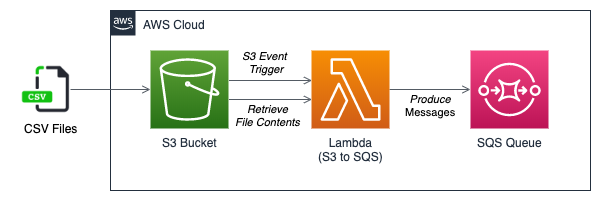

Architecture.

# AWS CLIs

#s3

// create s3 bucket :  
aws s3 mb s3://smsbucket --endpoint-url http://localhost:4566

// list s3 bucket :  
aws  --endpoint-url http://localhost:4566 s3 ls

// upload a file to s3 :  
aws s3 cp sms.csv s3://smsbucket/sms.csv --endpoint-url http://localhost:4566

// s3 put trigger notification :  
aws s3api put-bucket-notification-configuration --bucket smsbucket --notification-configuration file://notification.json --endpoint-url http://localhost:4566

--------------------------------------------------------------------------------------------------------------------------

#lambda

// create lambda :  
aws lambda --endpoint-url=http://localhost:4566 \
         create-function --function-name=hellolambda \
         --runtime=python2.7 \
         --role=whatever \
         --zip-file fileb:///Users/b0205391/PycharmProjects/LearnLocalStack/s3-to-sqs.py.zip \
         --handler=s3-to-sqs.lambda_handler

// delete lambda functions :  
aws lambda --endpoint-url=http://localhost:4566 delete-function --function-name=hellolambda

// invoke lambda :  
aws lambda --endpoint-url=http://localhost:4566 invoke --function-name hellolambda dd

// list lambda functions : 
aws lambda --endpoint-url=http://localhost:4566 list-functions

--------------------------------------------------------------------------------------------------------------------------

#SQS

// create sqs :  
aws --endpoint-url=http://localhost:4566 sqs create-queue --queue-name sms_queue

// send msg to sqs :  
aws --endpoint-url=http://localhost:4566 sqs send-message --queue-url http://localhost:4566/queue/smsqueue --message-body 
'Test Message!'

// retrieve msg from sqs :  
aws --endpoint-url=http://localhost:4566 sqs receive-message --queue-url http://localhost:4566/queue/sms_queue
